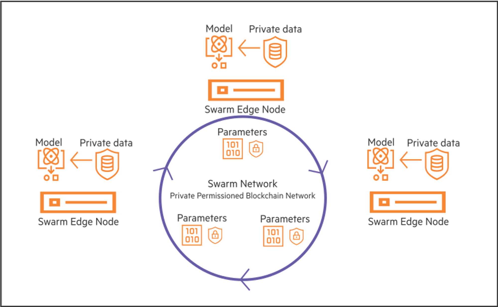

# swarm-learning-hpe | SurgerySwarm

[](https://github.com/RichardLitt/standard-readme)

Swarm learning based on HPE platform

## Table of Contents

- [Background](#background)
- [Install](#install)
- [Usage](#usage)
- [Maintainers](#maintainers)
- [Contributing](#contributing)
- [License](#license)

## Background

### Brief description about HPE platform

Course of Swarm Leaning explained in a generally understandable
way: [https://learn.software.hpe.com/swarm-learning-essentials](https://learn.software.hpe.com/swarm-learning-essentials)

HPE Swarm Learning extends the **concept of federated learning** to **decentralized learning** by adding functionality
that **obviates the need for a central leader**. It combines the use of **AI**, **edge computing**, and **blockchain**.

HPE Swarm Learning is a **decentralized, privacy-preserving Machine Learning (ML) framework**. Swarm Learning framework
uses the computing power at, or near, the distributed data sources to run the ML algorithms that train the models. It
uses the security of a blockchain platform to share learning with peers safely and securely. In Swarm Learning, training
of the model occurs at the edge, where data is most recent, and where prompt, data-driven decisions are mostly
necessary. In this decentralized architecture, **only the insights learned are shared** with the collaborating ML peers,
not the raw data. This tremendously enhances data security and privacy.

The following image provides an overview of the Swarm Learning framework. Only the model parameters (learnings) are
exchanged between the various edge nodes and not the raw data. This ensures that the privacy of data is preserved.


This is the Swarm Learning framework:


## Install

### Prerequisites
#### Hardware recommendations
* 64 GB of RAM (32 GB is the absolute minimum)
* 16 CPU cores (8 is the absolute minimum)
* an NVIDIA GPU with 48 GB of RAM (24 is the  minimum)
* 8 TB of Storage (4 TB is the absolute minimum)
* We deliberately want to show that we can work with lightweight hardware like this. Here are three quotes for systems like this for less than 10k EUR (Lambda, Dell Precision, and Dell Alienware)

#### Operating System
* Ubuntu 20.04 LTS
  * We have tested the Swarm Learning Environment on [Ubuntu 20.04 LTS, Ubuntu 22.04.2 LTS, Ubuntu 20.04.5 LTS] and they work fine. 
  *  Any experimental release of Ubuntu greater than LTS 20.04 MAY result in unsuccessful swop node running.
  * It also works on WSL2(Ubuntu 20.04.2 LTS) on Windows systems. WSL1 may have some issues with the docker service.

### Setting up the user and repository
1. Create a user named "swarm" and add it to the sudoers group.
Login with user "swarm".
```sh
$ sudo adduser swarm
$ sudo usermod -aG sudo swarm
$ sudo su - swarm
```
2. Run the following commands to set up the repository:

```sh
$ cd / && sudo mkdir opt/hpe && cd opt/hpe && sudo chmod 777 -R /opt/hpe
$ git clone https://github.com/KatherLab/swarm-learning-hpe.git && cd swarm-learning-hpe && git checkout surgery_swarm
```
Requirements and dependencies will be automatically installed by the script mentioned in the following section.

### Setting up the Swarm Learning Environment
**PLEASE REPLACE THE `<PLACEHOLDER>` WITH THE CORRESPONDING VALUE!**

`<sentinel_ip>` = `192.168.0.1` IP address of your sentinel host.

`<host_index>` = Your institute's name.

`<workspace_name>` = The name of the workspace you want to work on. You can find available modules under `workspace/` folder. For SurgerySwarm we suggest to use `surgery_swarm` here.

**Please only proceed to the next step by observing "... is done successfully" from the log**
1. `Prerequisite`: Runs scripts that check for required software and open/exposed ports.
```sh
$ sh workspace/automate_scripts/automate.sh -a
```
1. `Server setup`: Runs scripts that set up the swarm learning environment on a server.
```sh
$ sh workspace/automate_scripts/automate.sh -b -s <sentinel_ip> -d <host_index>
```
1. `Final setup`: Runs scripts that finalize the setup of the swarm learning environment. Only <> is required. The [-n num_peers] and [-e num_epochs] flags are optional.
```sh
$ sh workspace/automate_scripts/automate.sh -c -w <workspace_name> -s <sentinel_ip> -d <host_index> [-n num_peers] [-e num_epochs]
```

If problem encountered, please observe this [README.md](workspace%2Fautomate_scripts%2FREADME.md) file for step-by-step setup. Specific instructions are given about how to run the commands.
All the processes are automated, so you can just run the above command and wait for the process to finish.

If any problem occurs, please first try to figure out which step is going wrong, try to google for solutions and find solution in [Troubleshooting.md](Troubleshooting.md). Then contact the maintainer of the Swarm Learning Environment and document the error in the Troubleshooting.md file.

## Usage

### Data Preparation
1. Make sure you placed your data in the data folder.
```sh
mkdir workspace/<workspace-name>/user/data-and-scratch/data/
```

### Running Swarm Learning Nodes
To run a Swarm Network node -> Swarm SWOP Node -> Swarm SWCI node. Please open a terminal for each of the nodes to run. Observe the following commands:
- To run a Swarm Network (or sentinel) node:
```sh
$ ./workspace/automate_scripts/launch_sl/run_sn.sh -s <sentinel_ip_address> -d <host_index>
```

- To run a Swarm SWOP node:
```sh
$ ./workspace/automate_scripts/launch_sl/run_swop.sh -w <workspace_name> -s <sentinel_ip_address>  -d <host_index>
```

- To run a Swarm SWCI node(SWCI node is used to generate training task runners, could be initiated by any host, but currently we suggest only the sentinel host is allowed to initiate):
```sh
$ ./workspace/automate_scripts/launch_sl/run_swci.sh -w <workspace_name> -s <sentinel_ip_address>  -d <host_index>
```

- To check the logs from training:
```sh
$ ./workspace/automate_scripts/launch_sl/check_latest_logs.sh
```

- To stop the Swarm Learning nodes, --[node_type] is optional, if not specified, all the nodes will be stopped. Otherwise, could specify --sn, --swop for example.
```sh
$ ./workspace/swarm_learning_scripts/stop-swarm --[node_type]
```
### Viewing Results
```sh
 $ ./workspace/<workspace_name>/user/data-and-scratch/scratch
```

Please observe [Troubleshooting.md](Troubleshooting.md) section 10 for successful running logs of swop and sn nodes. The process will be keep running and displaying logs so you will need to open new terminal to run other commands.

## Maintainers

TUD Swarm learning team
[@Oliver](https://github.com/oliversaldanha25)
[@Jeff](https://github.com/Ultimate-Storm)
[@Kevin](https://github.com/pfeifferis)

## Contributing

Feel free to dive in! [Open an issue](https://github.com/KatherLab/swarm-learning-hpe/issues) or submit PRs.

Before creating a pull request, please take some time to take a look at
our [wiki page](https://github.com/KatherLab/swarm-learning-hpe/wiki), to ensure good code quality and sufficient
documentation. Don't need to follow all of the guidelines at this moment, but it would be really helpful!

## Credits

This project uses platform from the following repositories:

- [HewlettPackard/swarm-learning](https://github.com/HewlettPackard/swarm-learning): Created by [HewlettPackard](https://github.com/HewlettPackard)

## License

[MIT](LICENSE)
