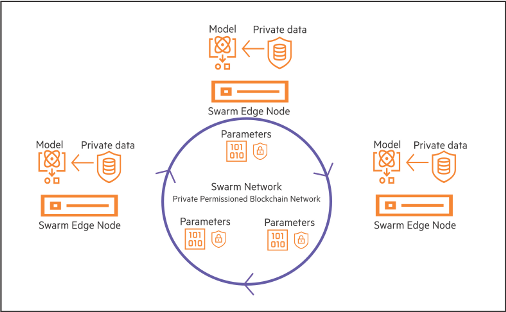
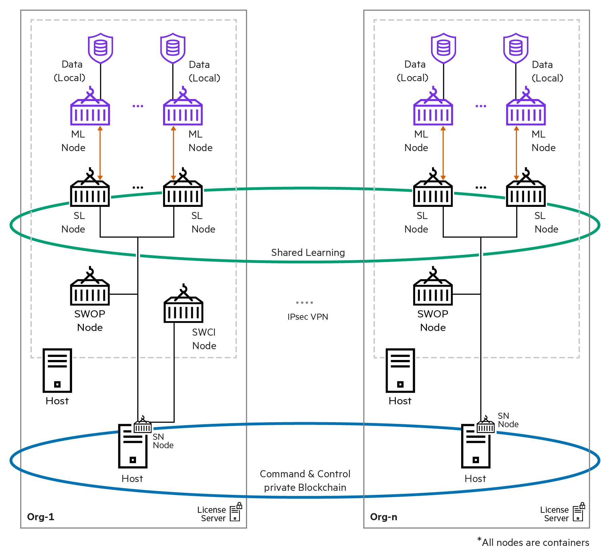
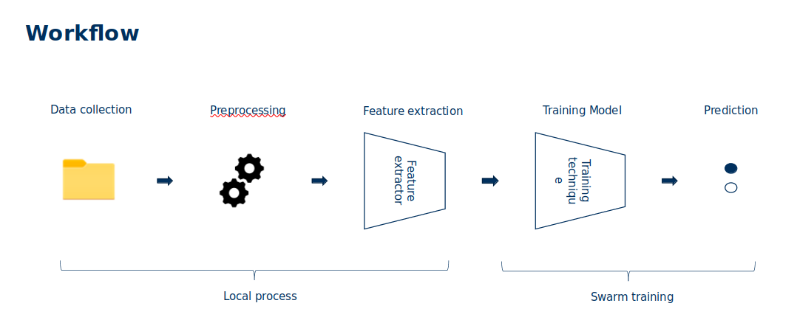
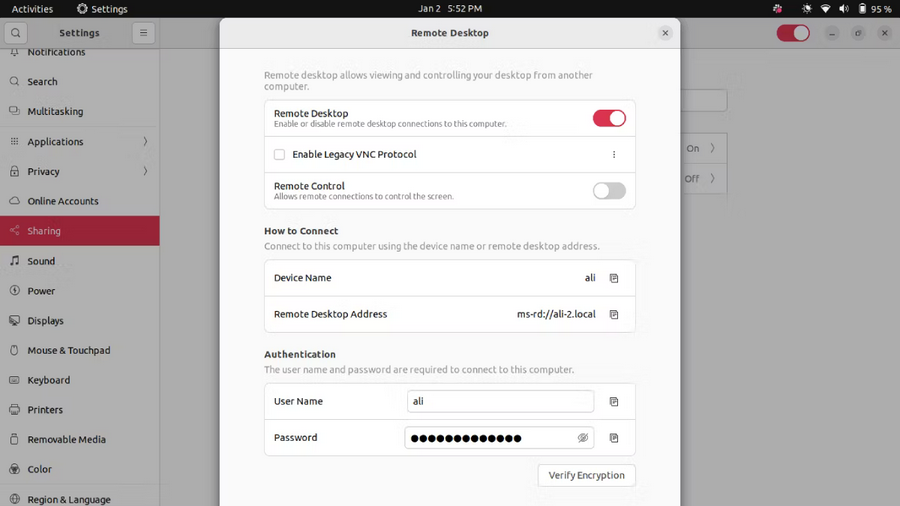

## Repo contents

This repository contains:

1. SWARM Learning For Histopathology Image Analysis and Radiology Image Analysis
2. [Work flow](https://github.com/KatherLab/projects/4) to help keep track of what's under process.
3. [Issue section](https://github.com/KatherLab/swarm-learning-hpe/issues) where people can dump ideas and raise
   questions encountered when using this repo.
4. Working version of [marugoto_mri](workspace%2Fmarugoto_mri) for Attention MIL based model, originally suitable for histopathology images but Marta has modified it to work with MRI images.
5. Working version of [odelia-breast-mri](workspace%2Fodelia-breast-mri) for 3D-CNN model by [@Gustav](gumueller@ukaachen.de). Related instructions please refer to [ODELIA.md](ODELIA.md) and following installation steps.
6. Working version of diffusion model for generating histopathology images and Xray images, [score-based-model](workspace%2Fscore-based-model) and [swag-latent-diffusion](workspace%2Fswag-latent-diffusion). Related instructions please refer to [SWAG.md](SWAG.md) and following installation steps.
## Prerequisites
### Hardware recommendations
* 64 GB of RAM (32 GB is the absolute minimum)
* 16 CPU cores (8 is the absolute minimum)
* an NVIDIA GPU with 48 GB of RAM (24 is the  minimum)
* 8 TB of Storage (4 TB is the absolute minimum)
* We deliberately want to show that we can work with lightweight hardware like this. Here are three quotes for systems like this for less than 10k EUR (Lambda, Dell Precision, and Dell Alienware)
* Typical installation time can take 30 minutes to build up the necessary dependencies and another 1 hour to build up the environment for running demo experiments

### Operating System
* Ubuntu 20.04 LTS
  * We have tested the Swarm Learning Environment on [Ubuntu 20.04 LTS, Ubuntu 22.04.2 LTS, Ubuntu 20.04.5 LTS] and they work fine. 
  *  Any experimental release of Ubuntu greater than LTS 20.04 MAY result in unsuccessful swop node running.
  * It also works on WSL2(Ubuntu 20.04.2 LTS) on Windows systems. WSL1 may have some issues with the docker service.
  

## Background

### Brief description about HPE platform

Course of Swarm Leaning explained in a generally understandable
way: [https://learn.software.hpe.com/swarm-learning-essentials](https://learn.software.hpe.com/swarm-learning-essentials)

HPE Swarm Learning extends the **concept of federated learning** to **decentralized learning** by adding functionality
that **obviates the need for a central leader**. It combines the use of **AI**, **edge computing**, and **blockchain**.

HPE Swarm Learning is a **decentralized, privacy-preserving Machine Learning (ML) framework**. Swarm Learning framework
uses the computing power at, or near, the distributed data sources to run the ML algorithms that train the models. It
uses the security of a blockchain platform to share learning with peers safely and securely. In Swarm Learning, training
of the model occurs at the edge, where data is most recent, and where prompt, data-driven decisions are mostly
necessary. In this decentralized architecture, **only the insights learned are shared** with the collaborating ML peers,
not the raw data. This tremendously enhances data security and privacy.

The following image provides an overview of the Swarm Learning framework. Only the model parameters (learnings) are
exchanged between the various edge nodes and not the raw data. This ensures that the privacy of data is preserved.

This is the Swarm Learning framework:

## Workflow

## Maintainers

TUD Swarm learning team

[@Jeff](https://github.com/Ultimate-Storm).

## Remote TeamViewer support(deprecated)
Wanna a 24-hours support? Configure your TeamViewer with the following steps and contact me through slack. Thanks [@Adrià](adriamarcos@vhio.net) for instructions.

1. Enable remote control in the ubuntu settings

2. Install TeamViewer and login with username: `adriamarcos@vhio.net` and password: `2wuHih4qC5tEREM`
3. Add the computer to the account ones, so that it can be controlled. You have it here: [link](https://community.teamviewer.com/English/kb/articles/4464-assign-a-device-to-your-accountuthorize)
4. I'd advise you to set the computer to never enter the sleeping mode or darken the screen just in case. Also, if you want to use different users remember this has to be done in all them and the TV session need to be signed in all them as well.
